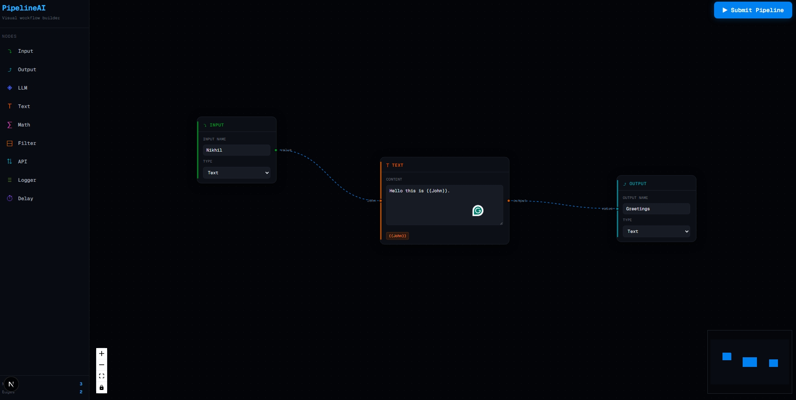

# Pipeline Builder



A **visual pipeline editor** that allows users to create nodes, connect them, and analyze the pipeline structure.

The application consists of:

* **Frontend:** Interactive node-based editor
* **Backend:** Pipeline graph analysis service

---

# Project Architecture

```
project-root
│
├── frontend
│   ├── src
│   ├── components
│   ├── nodes
│   ├── store
│   └── App.jsx
│
├── backend
│   ├── main.py
│   ├── models.py
│   ├── pipeline_service.py
│   └── utils
│
└── README.md
```

---

# Features

## Frontend

* Node-based pipeline editor
* Drag and drop nodes
* Connect nodes with edges
* Reusable **BaseNode abstraction**
* Dynamic node handles
* Auto-resizing text node
* Variable detection from text (`{{variable}}`)
* Clean and modern UI
* Submit pipeline to backend

## Backend

* FastAPI server
* Pipeline parsing endpoint
* Graph analysis
* Node and edge counting
* Directed Acyclic Graph (DAG) validation

---

# Frontend Setup

## Requirements

* Node.js ≥ 18
* npm or yarn

---

## Installation

```bash
cd frontend
npm install
```

---

## Run the Development Server

```bash
npm run dev
```

Application will run at:

```
http://localhost:3000
```

---

## Frontend Technologies

* React
* React Flow
* Tailwind / CSS

---

## Node System

The frontend uses a **node abstraction system** to avoid duplication.

```
BaseNode
 ├ InputNode
 ├ OutputNode
 ├ LLMNode
 ├ TextNode
 └ Custom Nodes
```

Each node defines:

* title
* input handles
* output handles
* UI content

---

## Text Node Features

The **TextNode** implements:

### Auto Resizing

The node grows automatically as text increases.

### Variable Detection

Variables are detected from text using:

```
{{variable}}
```

Example:

```
Hello {{name}}
Your id is {{userId}}
```

This dynamically generates **input handles** for:

```
name
userId
```

---

# Backend Setup

## Requirements

* Python ≥ 3.10
* pip

---

## Installation

```bash
cd backend
pip install -r requirements.txt
```

---

## Run Server

```bash
uvicorn main:app --reload
```

Server runs at:

```
http://localhost:8000
```

---

# Backend API

## Parse Pipeline

### Endpoint

```
POST /pipelines/parse
```

### Request

```json
{
  "nodes": [
    {"id": "1", "type": "input"},
    {"id": "2", "type": "llm"},
    {"id": "3", "type": "output"}
  ],
  "edges": [
    {"source": "1", "target": "2"},
    {"source": "2", "target": "3"}
  ]
}
```

---

### Response

```json
{
  "num_nodes": 3,
  "num_edges": 2,
  "is_dag": true
}
```

---

# DAG Detection

The backend validates whether the pipeline is a **Directed Acyclic Graph**.

Cycle detection is implemented using:

```
Depth First Search (DFS)
```

If a cycle is found:

```
is_dag = false
```

---

# Pipeline Flow

```
Frontend
    │
    │ POST /pipelines/parse
    ▼
Backend
    │
    │ Graph analysis
    ▼
Response
```

Frontend then displays pipeline statistics to the user.

---

# Example Pipeline

```
Input → LLM → Text → Output
```


